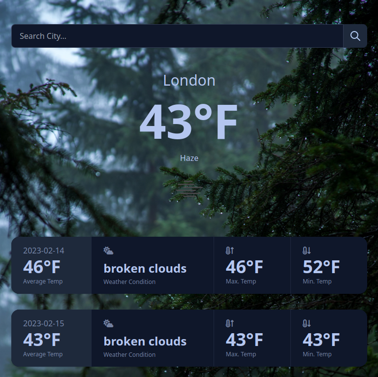

# weather-app
A weather app to practice async functions and using APIs.

https://alabador.github.io/weather-app/

## Built With
HTML, Tailwind CSS, DaisyUI, JavaScript, OpenWeather API. 

## Optimizations
Although the app is functional, there is room for improvement in terms of making the code less repetitive, and increasing performance.

The functions that get data and display data for today's weather, in comparison to the 5 day forecast have some reused code. More abstraction could help each of these functions with accomplishing only a single purpose, rather than multiple purposes. 

Using a framework such as React to pass in props/data between components would be beneficial as well. 

## Learnings
- Use of APIs, using Postman to help visualize and send get requests to read JSON data.
- ES6 destructuring, Array methods, and Async/await + promises
- More exposure to TailwindCSS and DaisyUI Library