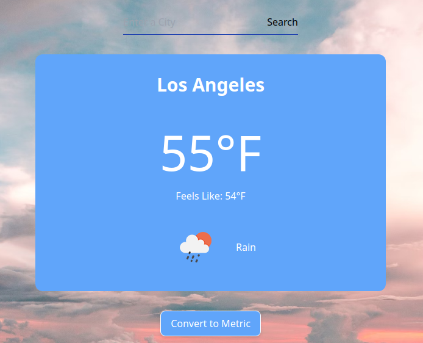

# weather-app
A weather app to practice async functions and using APIs.

https://alabador.github.io/weather-app/

## Built With
HTML, Tailwind CSS, JavaScript. 

First project using both tailwind and async functions/promises. 

## To-Do
- Add functionality to hange temp between imperial and metric
- Change image every time a location is searched [STC]